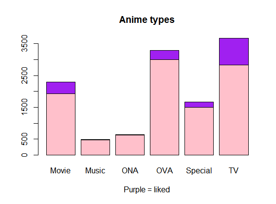

---
title: Anime recomendation with clustering and MCA analysis
author: "Minna Peralampi"
date: "27 helmikuuta 2017"
email: minna.peralampi@helsinki.fi
output: html_document

--

#Research questions
#### Can we predict with chosen variables wether anime is being liked or not?
#### 

##Link to the R-script

       
## The data
#### The data is downloaded from kaggele (2.3.2017).
<https://www.kaggle.com/CooperUnion/anime-recommendations-database>
It orgins from myanimelist.net website.
Data is about animes ratings in myanimelist.net.

Variables in the data:
1. type is a factor variable which has values [Movie, TV, OVA, ONA, Special, TV]
2. episodes, which is the number of episodes anime has.
3. members is the number of people in the animes "fan group"
4. genre_clusters is the number of cluster that the animes genres belong to [1-8].
  - Why? There was over 2000 unique genre combinations of the 44 genres. Putting them into groups by clustering made it a resonable variable to look into.

Data modification
  1. Animes with NA values were removed (such as animes with no genre or type)
  2. 44 genres were reduced to 8 clusters 
  3. Anime names were made to a rownames
  
#VARIABLE PICTURES

    #Downloading the data
    setwd("C:/Users/Minna/Documents/GitHub/IODS-final/IODS-final")
    anime <- read.csv("anime_gen")
    #Drawing the type variable
    counts <- table(anime$rating, anime$type)
    barplot(counts , main="Anime types", xlab = "Purple = liked", col=c( "pink", "purple"))
    
    

    #Drawing the episodes variable
    library(ggplot2)
    g <- anime %>% 
    mutate(episodes = as.numeric(episodes)) %>% 
    ggplot(aes(episodes, rating) +
    geom_point(aes(color = type)